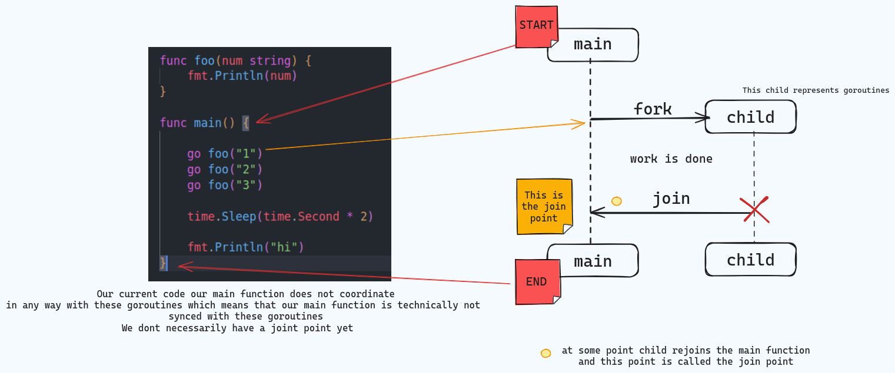

# go-Concurrency
This repository provides a collection of practical exercises and code examples designed to help you master goroutines, channels, synchronization primitives, and other essential concurrency patterns in Go.

## Goroutiness are not synced.

## Channels

### Channels are typically used to communicate information between goroutines
### because goroutines are running independently of one another and don't
### require knowledge of each other. So in order for our goroutines to communicate
### we can have them reference the same place in memory which is where a channel would reside.

